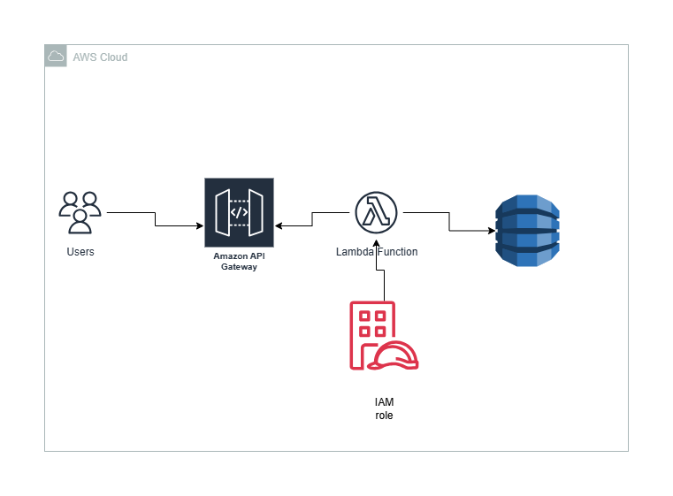

# 🕒 AWS Attendance System

This project is a simple *Attendance System* built on AWS.  
Users can check in by entering their name or ID, and the system records the check-in time automatically using *AWS Lambda, **API Gateway, and **DynamoDB*.

---

## 🧱 Architecture Diagram

---

## 🎥 Project Demo (YouTube)

Watch the full walkthrough video here:  
👉 [https://youtu.be/yVyuMmEDEPk](https://youtu.be/yVyuMmEDEPk)

---

## 🚀 Tech Stack

- HTML + JS (Frontend)
- AWS Lambda (Backend Logic)
- API Gateway (REST API)
- DynamoDB (Database)
- CloudWatch (Monitoring & Logs)
- S3 (Hosting the HTML file)

---

## ✅ Features

- Simple check-in form using HTML
- Records user ID and timestamp
- Real-time data saved to DynamoDB
- Easily extendable for future use (authentication, reporting, etc.)"# Attendance-system" 
